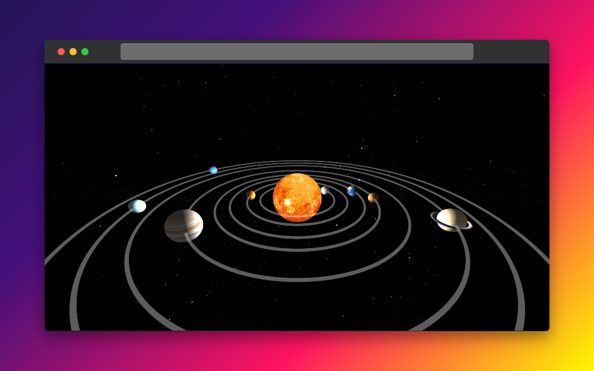
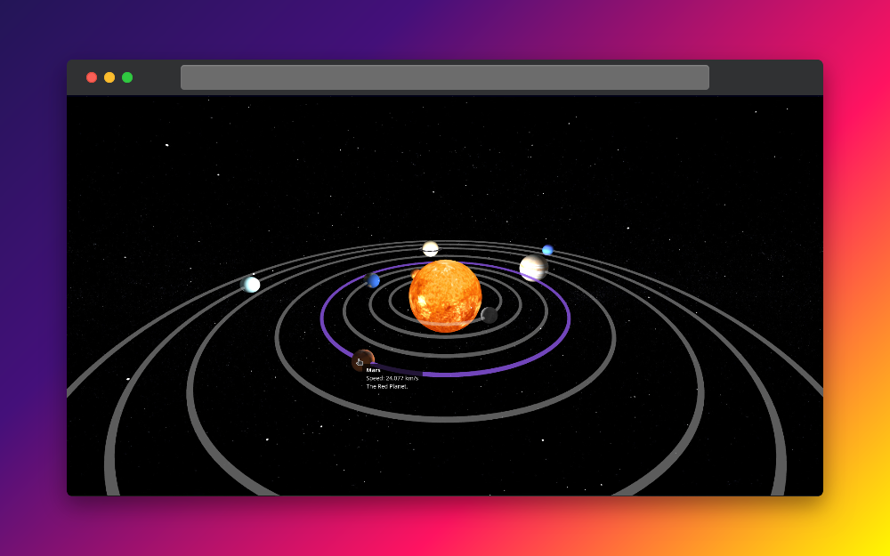
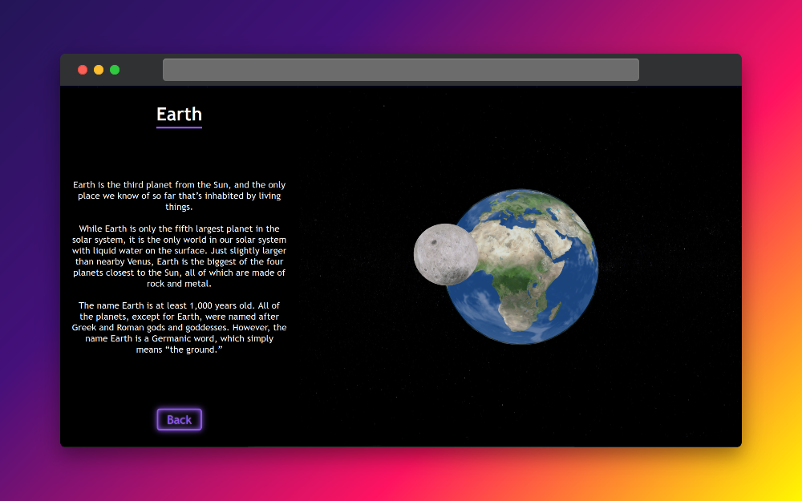

# 🌌 Solar System 3D

**A highly realistic, interactive 3D solar system built with [Three.js](https://threejs.org/), vanilla JavaScript, and localStorage.**  
Planets orbit the sun, rotate on their axes, and can be clicked for more info — all inside your browser.


## 🚀 Features

- 🪐 **Fully interactive 3D solar system**  
  Click on any planet to focus and explore.

- 🌍 **Realistic planetary textures**  
  NASA-based textures give each planet a lifelike feel.

- 🌀 **Orbit animations & self-rotation**  
  Planets orbit the sun and spin around their axes.

- 💾 **State persistence via localStorage**  
  Your last selected planet is remembered across sessions.

- 🔭 **Intuitive camera controls**  
  Smooth orbital navigation using mouse or touch.

- 🧪 **No frameworks required**  
  Written in vanilla JavaScript with just Three.js — fast and lightweight.

## 🖥️ Demo

👉 [Live Demo](https://billykonstas.github.io/solar-system)

## 🧠 Tech Stack

- **Three.js** for 3D rendering and scene management
- **Vanilla JavaScript** for all application logic
- **localStorage** to remember selected planets
- **GLTF / texture maps** for realistic planetary visuals

## 📁 Project Structure

```
solar-system/
├── assets/             # Textures and planet maps
├── js/                 # Core JavaScript files (scene, planets, storage)
├── index.html          # Entry point
├── style.css           # Minimal styling
└── README.md
```

## 🛠️ Getting Started

Clone the repo and open `index.html` in your browser:

```bash
git clone https://github.com/billykonstas/solar-system.git
cd solar-system
open index.html  # or double-click it
```

> No build tools or bundlers needed. Just open the file and explore the universe.

## ✨ Future Ideas

- Mobile optimization (WIP)

## 🤝 Contributing

Pull requests are welcome! If you spot a bug or have a killer idea for the universe, feel free to fork and submit a PR.

## 📸 Screenshots

| Solar System Overview                 | Planet Hover                                       | Focus on Earth                        |
|---------------------------------------|----------------------------------------------------|---------------------------------------|
|  |  |  |

## 📜 License

[MIT](LICENSE)

---

> Built with ☕ by [@billykonstas](https://github.com/billykonstas)